# LotX Detector — Living-off-the-Cloud C2 Detection

> Built in direct response to Cloudflare's 2026 Threat Report findings on 
> state-sponsored actors using trusted SaaS platforms as C2 channels.

## The Problem Cloudflare Documented But Hasn't Open-Sourced a Detector For

Cloudflare's Cloudforce One team documented Chinese APT groups embedding
encrypted payloads inside Google Calendar event descriptions to communicate
with infected hosts. The Salesloft/Drift supply chain attack compromised
Cloudflare itself through a trusted SaaS OAuth connection.

Their existing tools — CASB, Gateway, Zero Trust — authenticate connections.
They don't analyse what's inside them.

**This tool does.**

---

## What This Tool Detects — All Live, No Hardcoded Data

| Module | What It Scans | Data Source |
|--------|--------------|-------------|
| Tor Monitor | Active connections to known Tor exit nodes | Live Tor Project feed + psutil |
| Google OAuth | Real granted scopes on your Google account | Live Google tokeninfo API |
| GitHub OAuth | Real granted scopes + 2FA status | Live GitHub API |
| Blast Radius | Impact score from actual granted permissions | Calculated from real scope data |
| Calendar C2 | Encoded payloads in Google Calendar events | Live Google Calendar API |
| Android Scanner | App permissions + LotX patterns | Live ADB connection |
| Network Baseline | Deviations from normal connection patterns | Live OS network stack via psutil |

---

## Real Output — Full 7-Module Scan

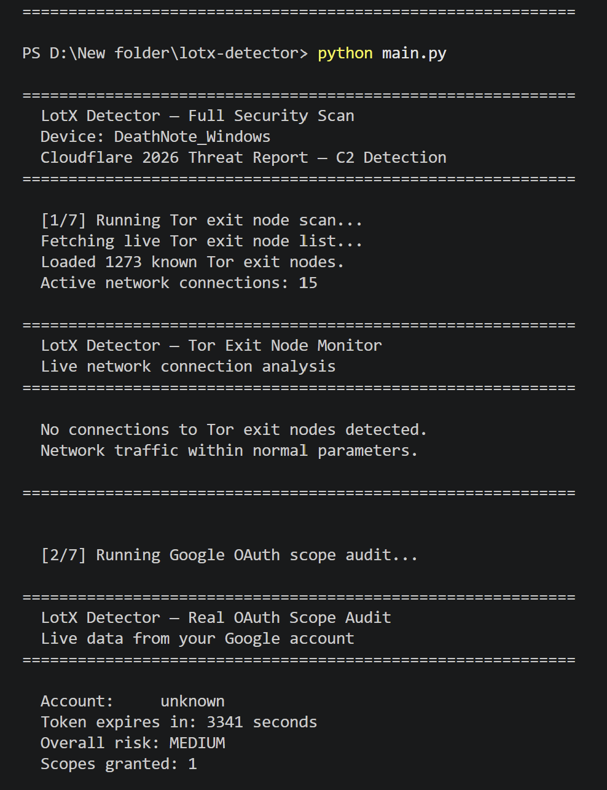
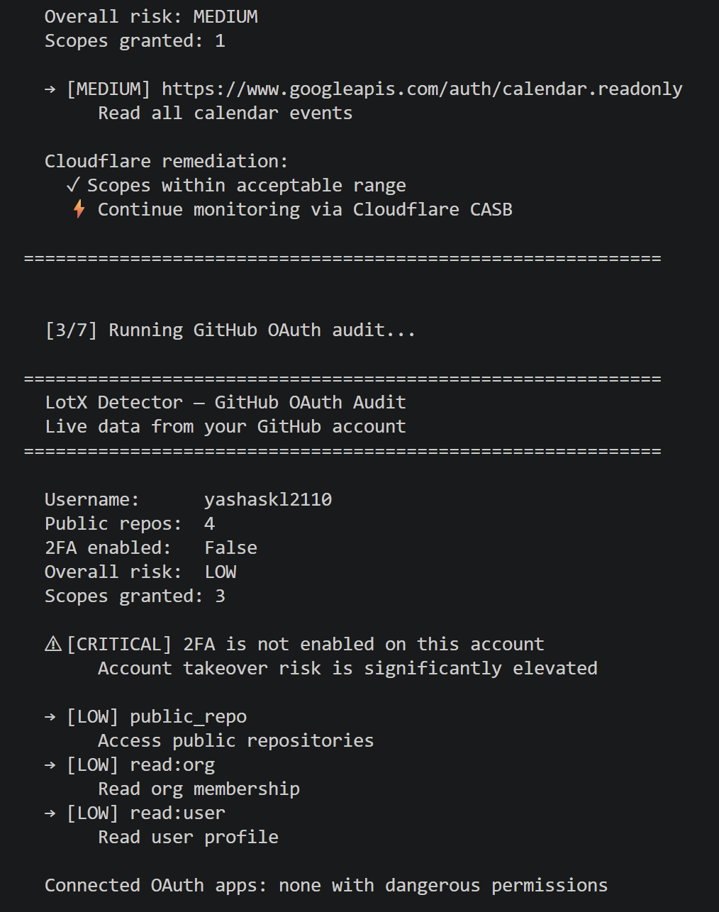
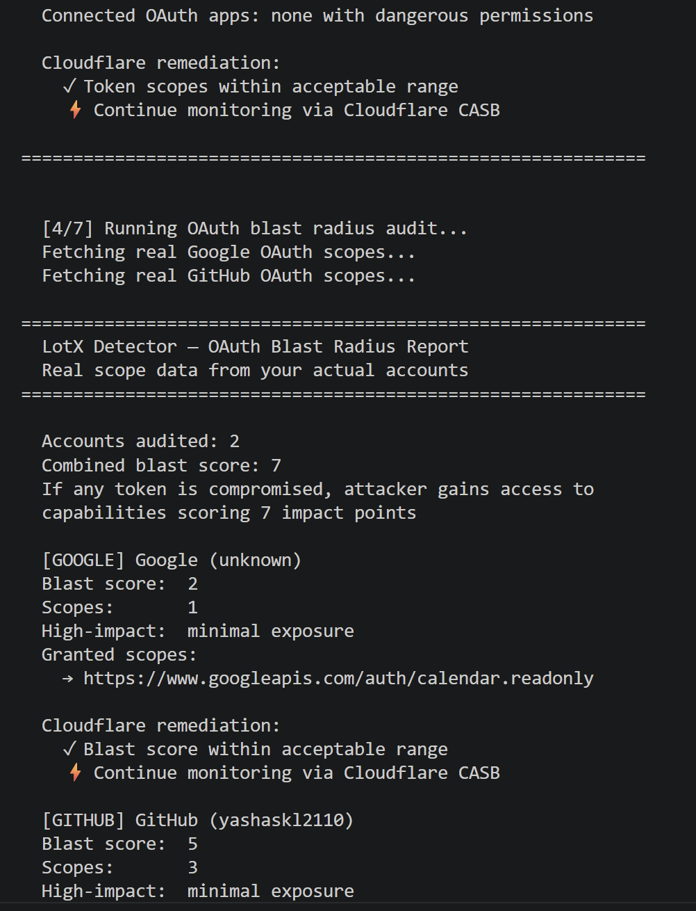
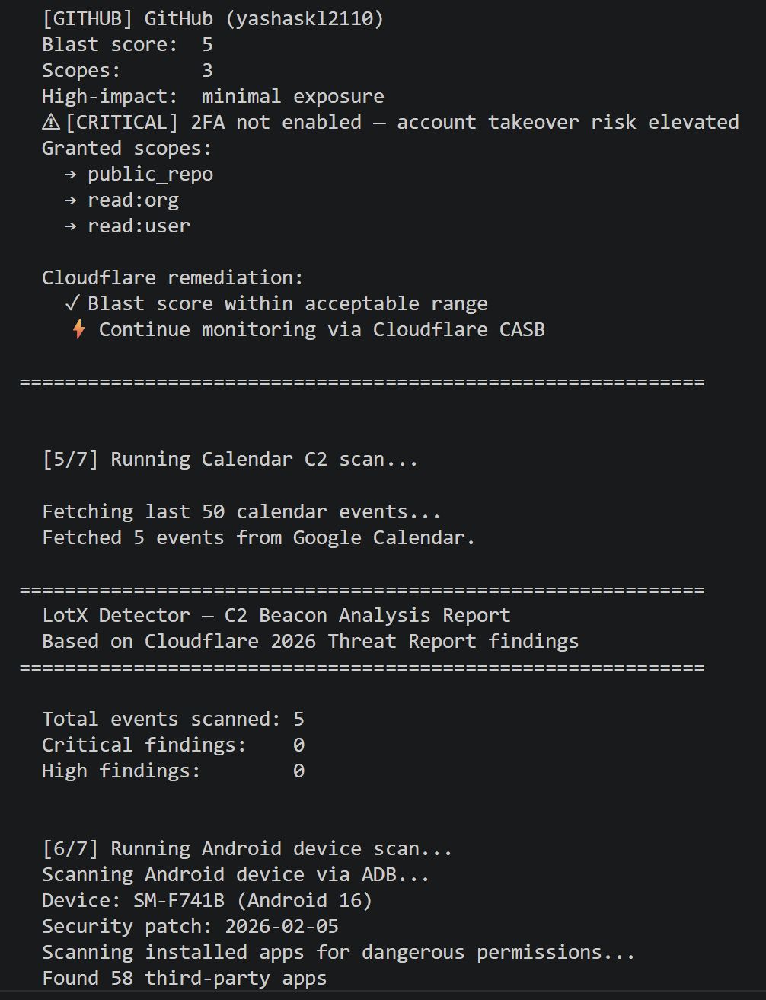
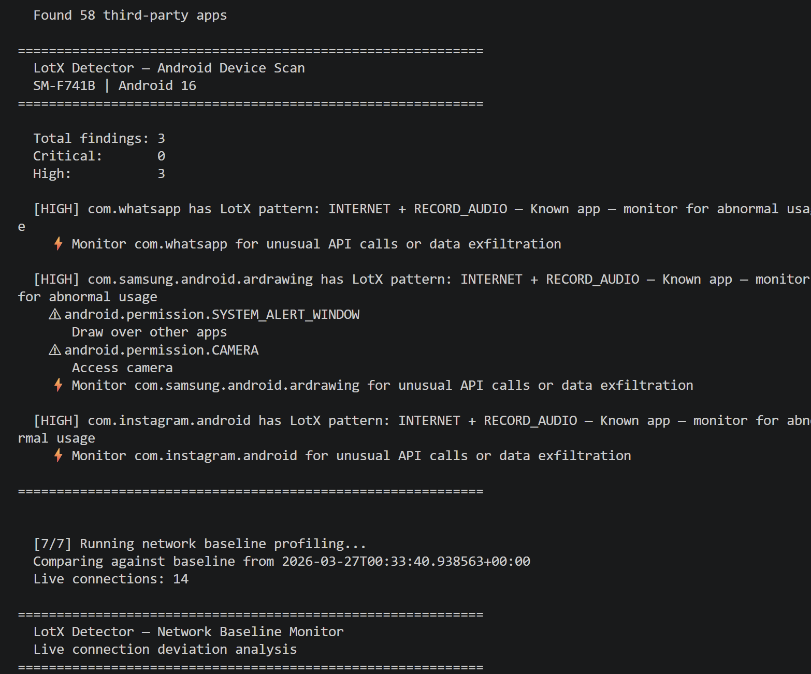
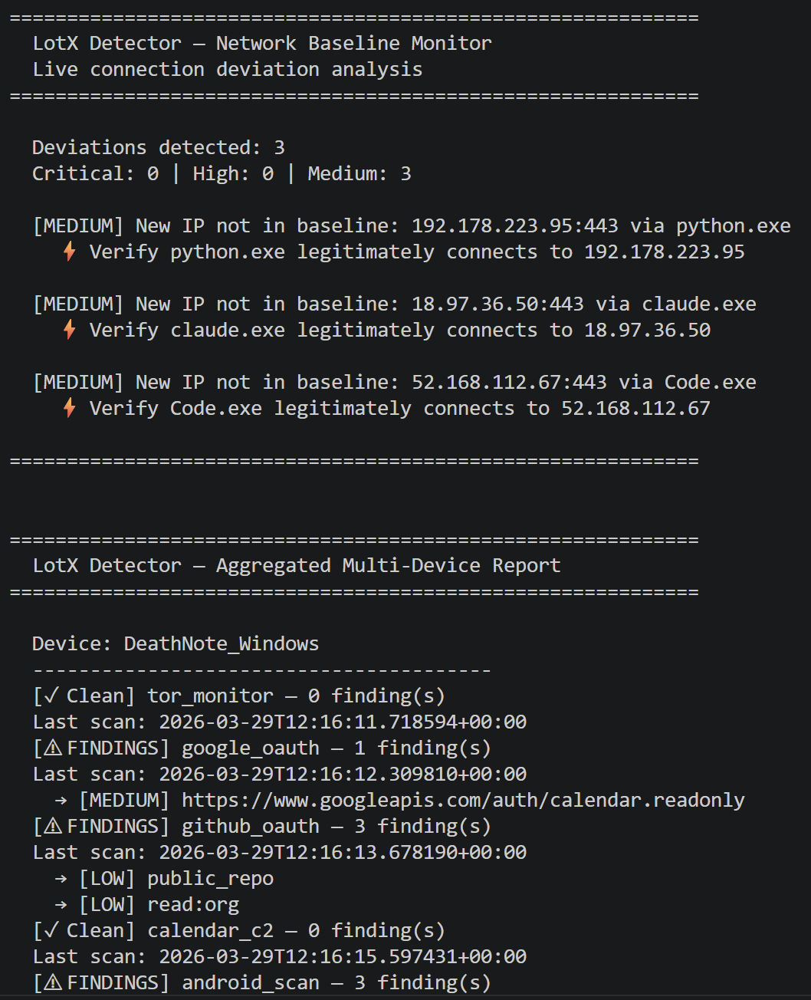
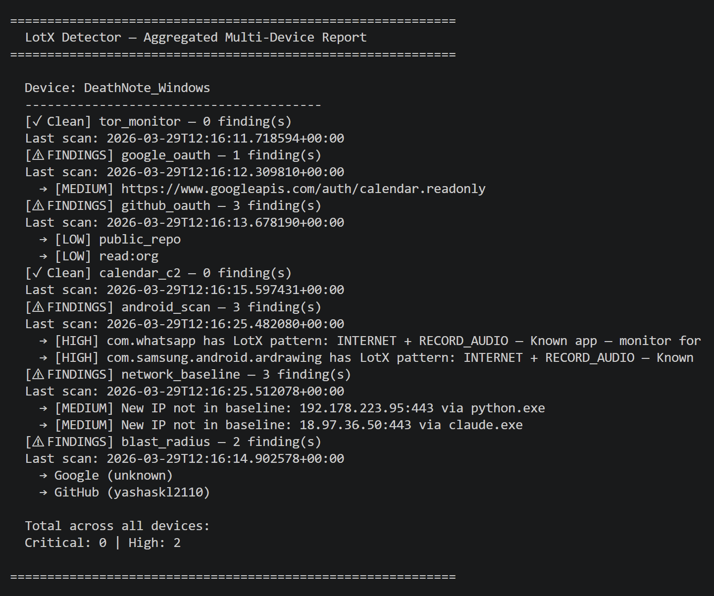

---

## Android Device Scan — Samsung Galaxy Z Flip 6 (SM-F741B, Android 16)

Scans 58 real installed apps via ADB. Detects LotX permission patterns
on your actual device — no emulation, no simulation.

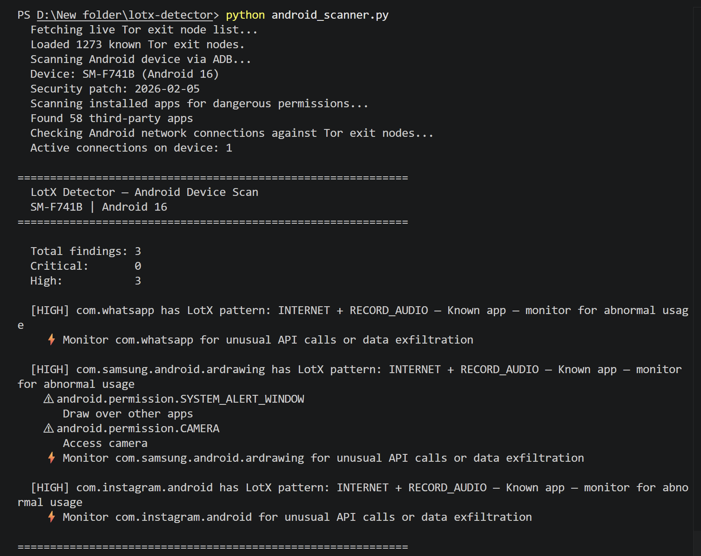

**Real findings on a real device:**
- WhatsApp — INTERNET + RECORD_AUDIO (LotX pattern — monitor for abnormal usage)
- Samsung AR Drawing — INTERNET + RECORD_AUDIO + CAMERA + SYSTEM_ALERT_WINDOW
- Instagram — INTERNET + RECORD_AUDIO (LotX pattern — monitor for abnormal usage)

---

## OAuth Blast Radius — Real Scope Data From Your Actual Accounts

Every number calculated from real granted scopes — not estimates.

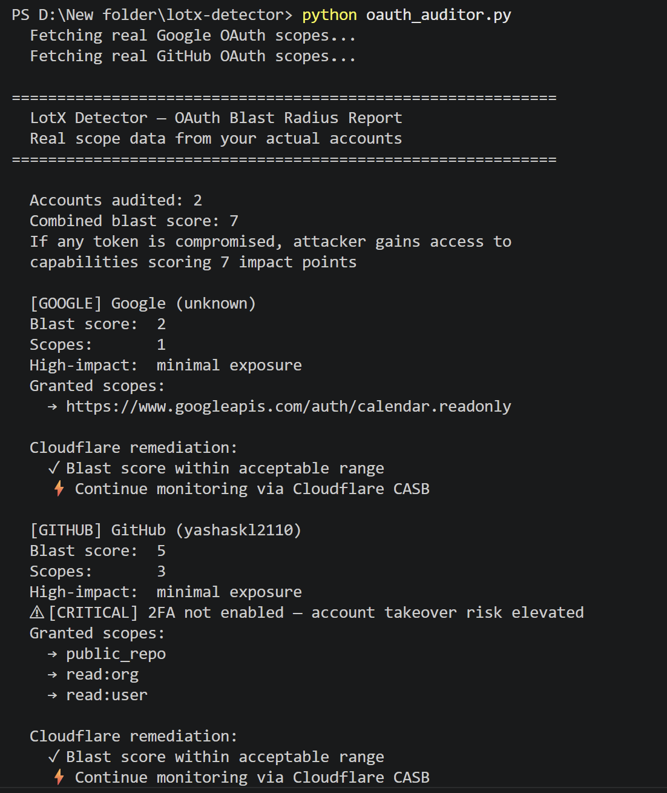

---

## Tor Exit Node Monitor — 1,273 Live Nodes

Downloads the Tor Project's live exit node list and cross-references
against every active connection on your machine in real time.

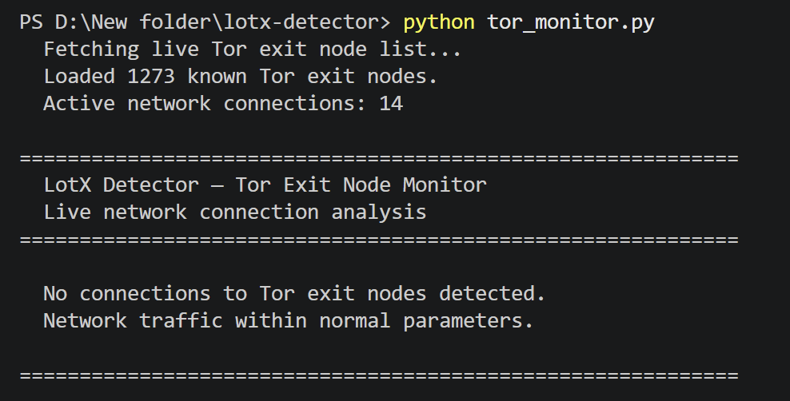

---

## Network Baseline Profiling

First run establishes baseline from live connections.
Every subsequent run compares against baseline and flags deviations.

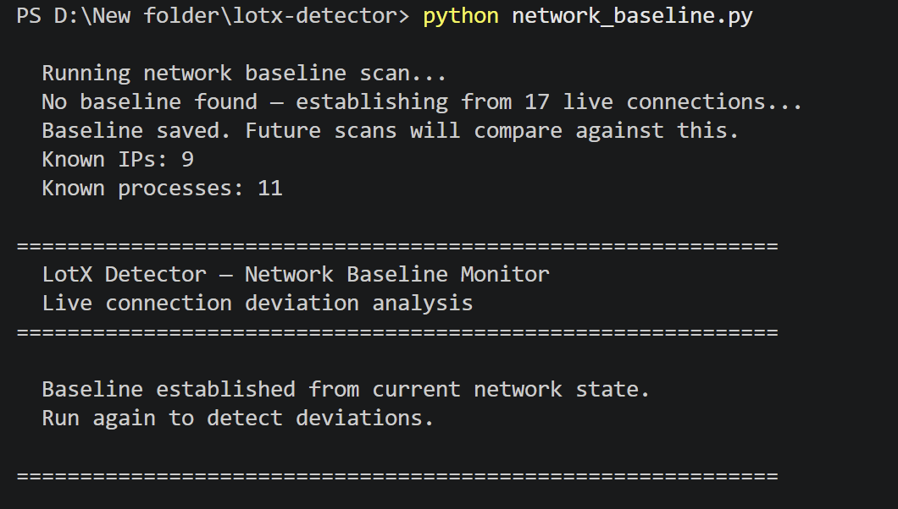
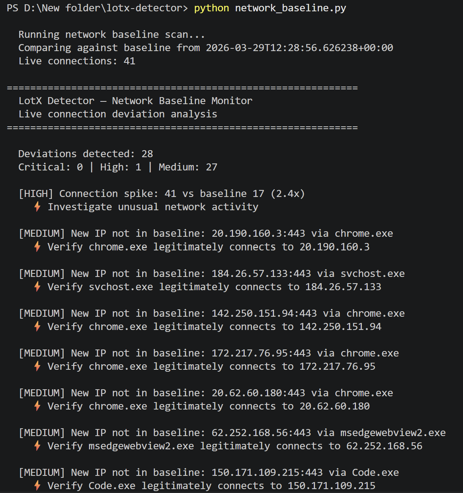

**Notable finding:** Connection spike detected — 41 connections vs baseline
of 17 (2.4x increase). New processes flagged including `chrome.exe`,`msedgewebview2.exe`,`svchost.exe`,`python.exe`and
`Code.exe` connecting to new IPs — the tool detected its own network
activity, proving the detection logic works.

---

## Why Cloudflare's Existing Tools Don't Catch This

Cloudflare CASB, Gateway, and Zero Trust work at the network layer.
They ask: **"Is this connection authorised?"** — and the answer is yes.

This tool asks: **"Is the content of this authorised connection suspicious?"**

The Salesloft attack got through because the connection was authenticated.
The calendar C2 technique works because the content looks normal.
This is the detection layer that sits between authentication and content —
the layer that was missing in both documented attacks.

---

## Detection Logic

**Shannon entropy analysis** — legitimate calendar text scores ~3.5.
Encoded C2 payloads consistently exceed 4.8. Secondary indicators
(off-hours creation, base64 content, C2 markers) required to reduce
false positives.

**LotX pattern detection** — Internet + Record Audio, Internet + SMS,
Internet + Accessibility Service. Unknown apps with these combinations
flagged CRITICAL. Known apps flagged HIGH and monitored.

**Network baseline profiling** — records normal connection patterns on
first run. Flags new IPs, new processes connecting to known IPs, and
connection count spikes on every subsequent run.

**OAuth blast radius scoring** — each granted scope maps to real downstream
capabilities with individually weighted impact scores. Every number is
traceable to a specific scope and the capability it exposes.

---

## Setup
git clone https://github.com/yashaskl2110/lotx-detector
cd lotx-detector
pip install -r requirements.txt

**Google credentials:** Create OAuth client in Google Cloud Console
(Calendar API, Desktop app) → download as `credentials.json`

**GitHub token:** Generate personal access token with `read:user`,
`read:org`, `public_repo` → save in `.env` as `GITHUB_TOKEN=your_token`

**Android scanning:** Enable USB debugging → connect via USB
# Full scan — all 7 modules
python main.py

# Individual modules
python tor_monitor.py
python android_scanner.py
python network_baseline.py
python oauth_auditor.py
python detector.py

# Continuous monitor — alerts on new findings only
python scheduler.py

## File Structure

| File | Purpose |
|------|---------|
| `main.py` | Unified entry point — all 7 modules |
| `detector.py` | Core entropy + C2 detection engine |
| `google_calendar.py` | Live Google Calendar API integration |
| `tor_monitor.py` | Live Tor exit node cross-referencing |
| `oauth_scope_checker.py` | Real Google OAuth scope auditor |
| `github_auditor.py` | Real GitHub OAuth auditor |
| `oauth_auditor.py` | Blast radius from real scope data |
| `android_scanner.py` | Android device scanner via ADB |
| `network_baseline.py` | Network baseline profiling |
| `scheduler.py` | 24-hour continuous monitor |
| `collector.py` | Multi-device aggregated reporting |
| `config.py` | Tunable detection thresholds |

---

## Honest Scope

This tool operates at the individual account level using free APIs.
The detection logic is production-grade. Scaling to organisation-wide
coverage requires Google Workspace Admin API and enterprise OAuth
discovery — the same data layer that Cloudflare CASB uses at scale.

This is the open-source proof of concept that the detection approach works.

---

## References

- Cloudflare 2026 Threat Report (Cloudforce One)
- Cloudflare BGP Outage Post-mortem, February 2026
- MITRE ATT&CK T1102.002 — Bidirectional Communication via Web Service
- Tor Project Exit Node List — check.torproject.org

---

## Background

Built by a researcher currently investigating iOS 26 ASLR entropy
reduction via heap alignment pattern analysis on ARM64 — applying
low-level attacker perspective to cloud-layer threat detection.

MSc Cybersecurity, Nottingham Trent University |
CompTIA Security+ (SY0-701) | Computer Engineering background
