# LotX Detector — Living-off-the-Cloud C2 Detection

> Cloudflare's tools ask: **"Is this connection authorised?"**
> The answer is yes. The attack still succeeds.
>
> This tool asks: **"Is the content of this authorised connection suspicious?"**

---

## The Detection Gap

Cloudflare's 2026 Threat Report documented two attacks that their own stack didn't catch:

**1. Calendar C2 (Cloudforce One, 2026)**
Chinese APT groups embedded encrypted payloads inside Google Calendar event descriptions to communicate with infected hosts. The traffic was authenticated. The platform was trusted. CASB, Gateway, and Zero Trust saw nothing — because the connection was legitimate. The payload was in the content.

**2. Salesloft/Drift supply chain attack**
Compromised Cloudflare itself through a trusted SaaS OAuth connection. The connection was authorised. The blast radius wasn't measured until after the breach.

Cloudflare documented both. No open-source detector exists for either.

**This tool is that detector.**

---

## What It Does

Seven detection modules, all running against live data — no hardcoded values, no simulation:

| Module | What It Detects | Data Source |
|--------|----------------|-------------|
| Calendar C2 | Shannon entropy analysis on Google Calendar event descriptions — flags encoded C2 payloads | Live Google Calendar API |
| OAuth Blast Radius | If this token is compromised, what exactly can an attacker do? Scored by capability, not just scope name | Live Google + GitHub tokeninfo APIs |
| Google OAuth Audit | Real granted scopes on your Google account — what you've actually authorised | Live Google tokeninfo API |
| GitHub OAuth Audit | Real granted scopes + 2FA status | Live GitHub API |
| Tor Exit Monitor | Cross-references every active connection on your machine against 1,273 live Tor exit nodes | Live Tor Project feed + psutil |
| Android Scanner | LotX permission patterns across all installed apps — flags combinations, not just individual permissions | Live ADB connection |
| Network Baseline | Establishes normal connection patterns, flags new IPs, process hijacks, and connection spikes on every subsequent run | Live OS network stack via psutil |

---

## Detection Logic

**Shannon entropy analysis**
Legitimate calendar text scores ~3.5 entropy. Encoded C2 payloads consistently exceed 4.8. The tool requires secondary indicators — off-hours creation, base64-decodable content, known C2 markers — before escalating to CRITICAL. Single-signal flags are HIGH at most, reducing false positives without missing real findings.

**OAuth blast radius scoring**
Each granted scope maps to downstream capabilities with individually weighted impact scores. `repo` scope doesn't just mean "code access" — it means `code_read`, `code_write`, `secret_access`, `ci_trigger`, `deploy_trigger`. Every number in the blast score is traceable to a specific scope and the capability it exposes.

**LotX pattern detection**
`INTERNET + RECORD_AUDIO`, `INTERNET + READ_SMS`, `INTERNET + BIND_ACCESSIBILITY_SERVICE`. Unknown apps with these combinations: CRITICAL. Known apps (WhatsApp, Instagram) with these combinations: HIGH with monitoring note — because trusted apps are exactly what LotX attackers abuse.

**Network baseline profiling**
First run records normal state. Every subsequent run flags new IPs, known IPs now used by new processes (possible hijack), connections to high-risk ports, and connection count spikes. The tool flagged its own network activity during testing — 41 connections vs baseline of 17 — proving the detection logic works.

---

## Real Output

Full 7-module scan against real accounts and a real Android device (Samsung Galaxy Z Flip 6, SM-F741B, Android 16). No emulation. No mocked data.

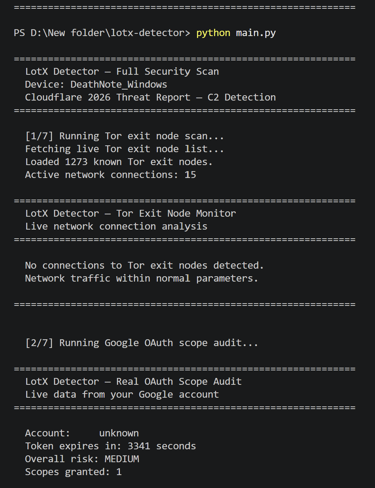
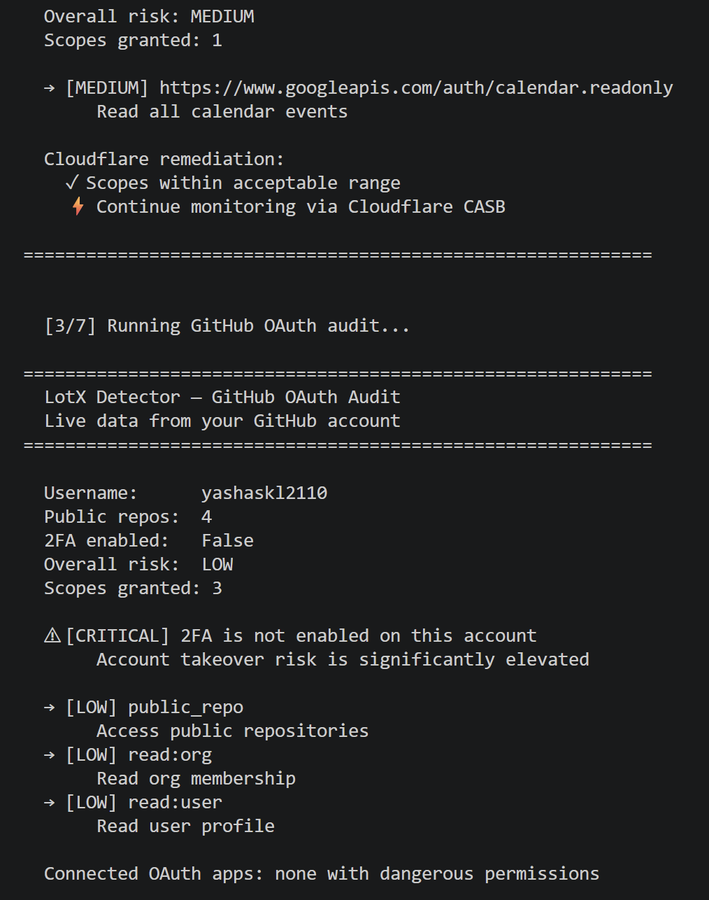
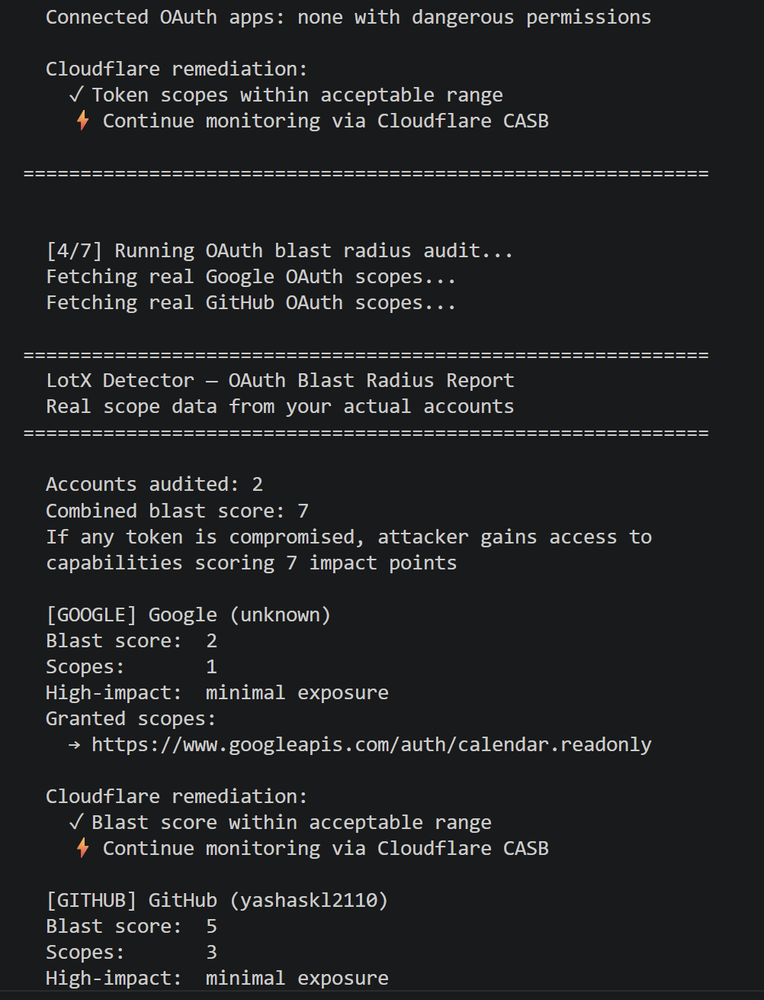
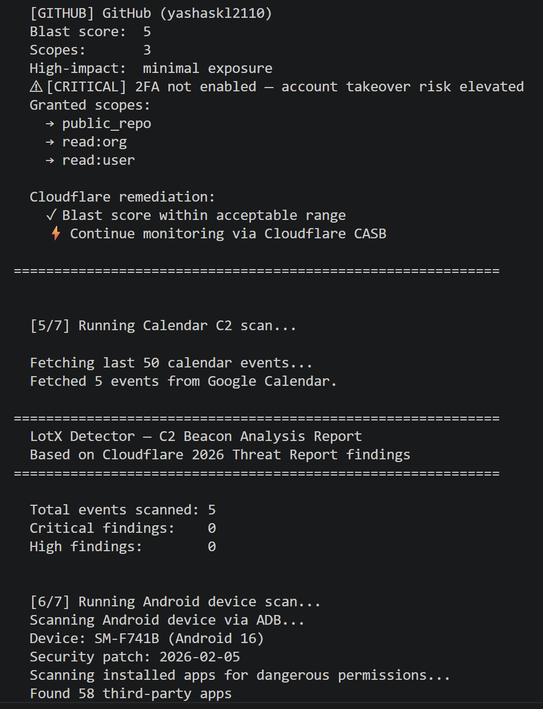
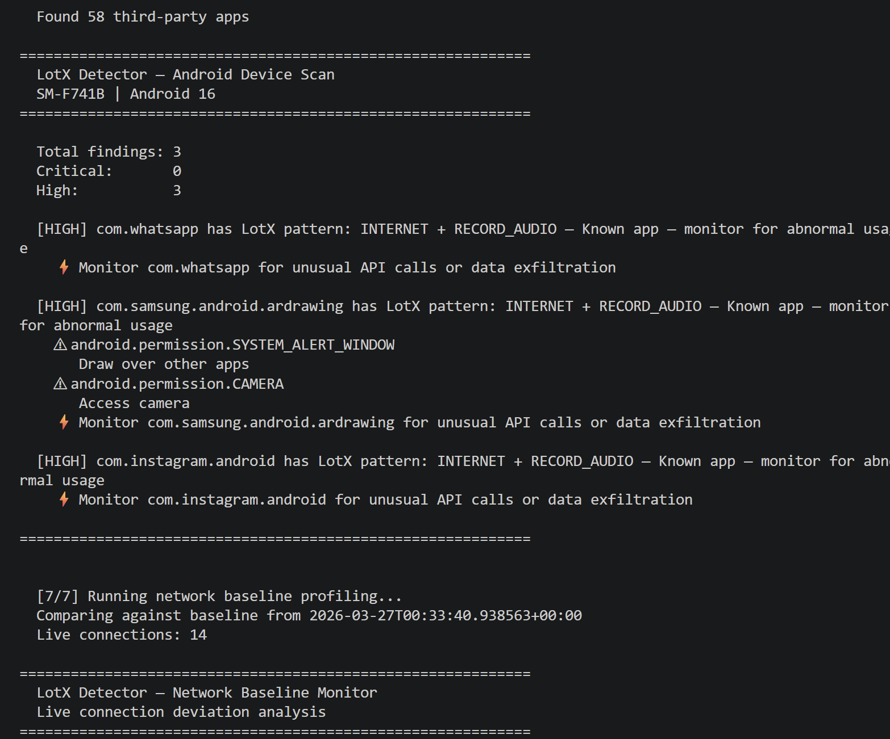
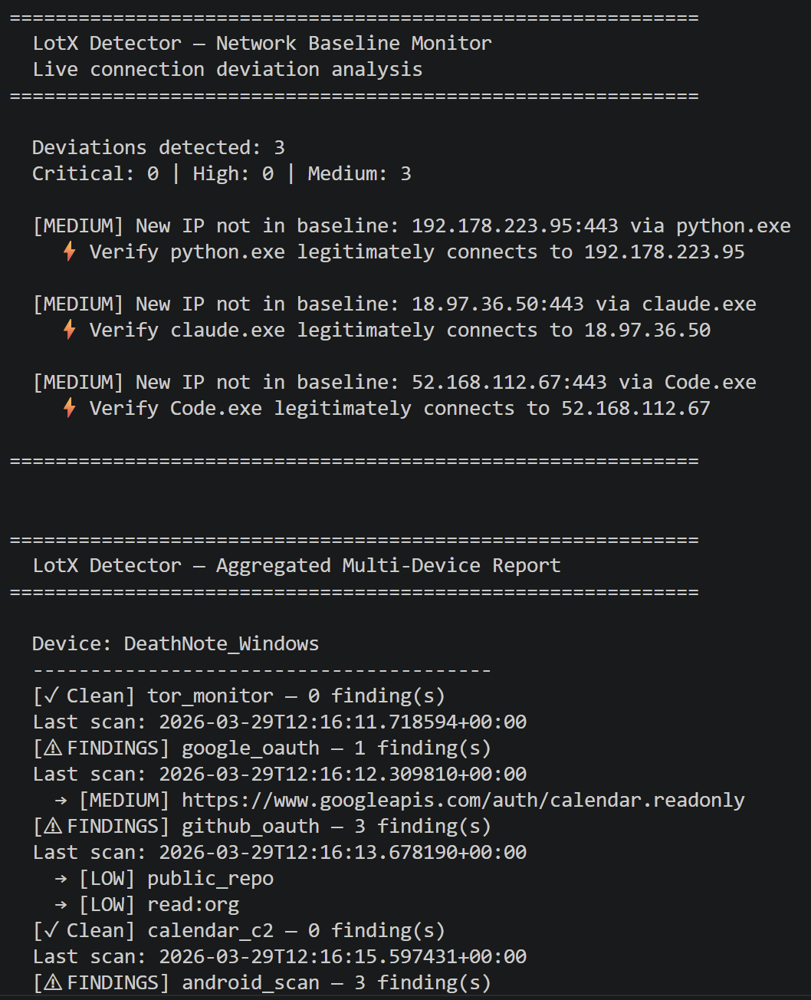
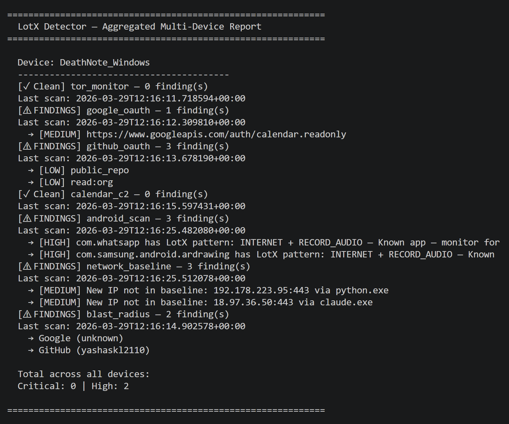

**Android scan — real findings on a real device:**

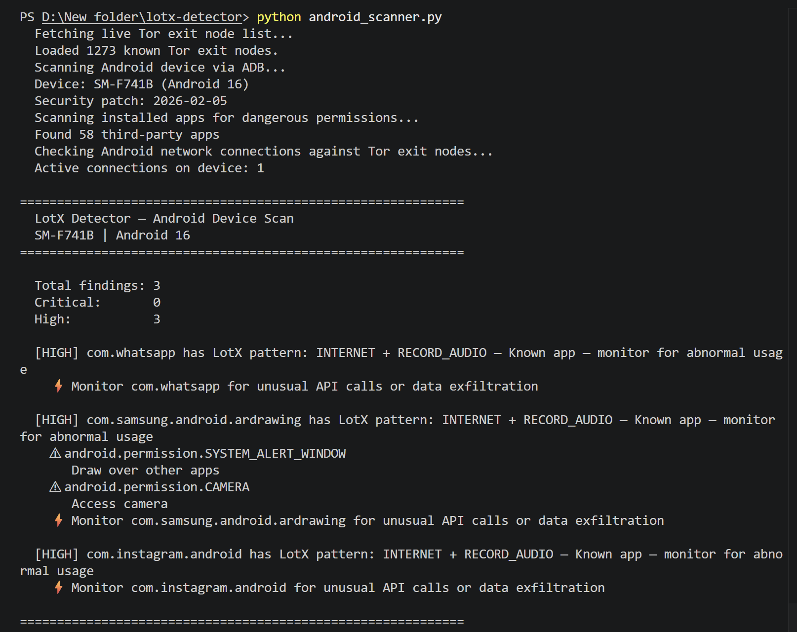

- WhatsApp — `INTERNET + RECORD_AUDIO` (LotX pattern — monitor for abnormal usage)
- Samsung AR Drawing — `INTERNET + RECORD_AUDIO + CAMERA + SYSTEM_ALERT_WINDOW`
- Instagram — `INTERNET + RECORD_AUDIO` (LotX pattern — monitor for abnormal usage)

**OAuth blast radius — real scope data:**

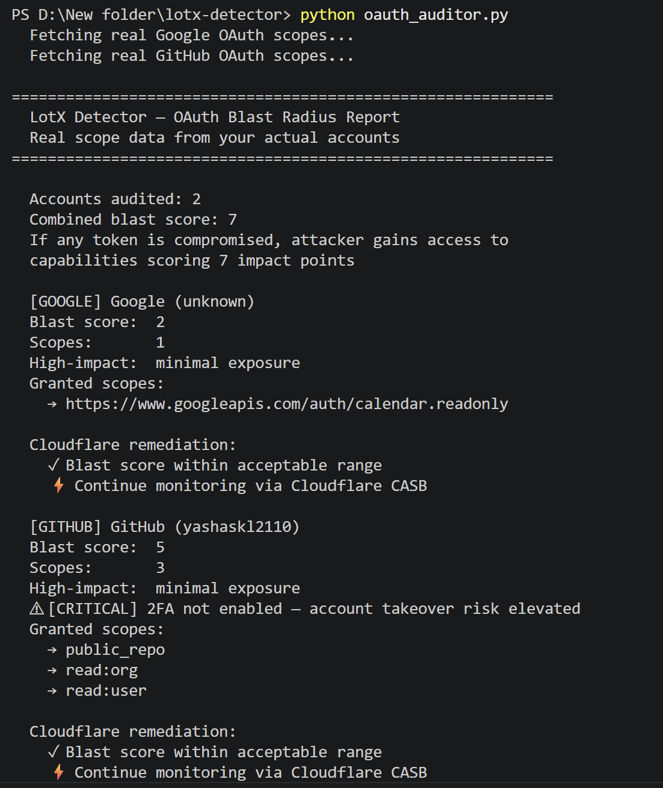

**Tor exit node monitor — 1,273 live nodes:**

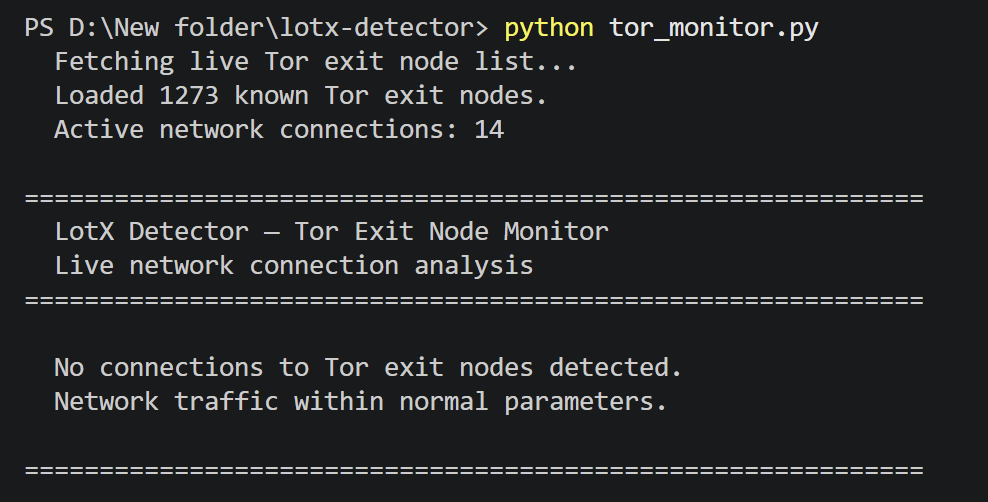

**Network baseline — deviation detection:**

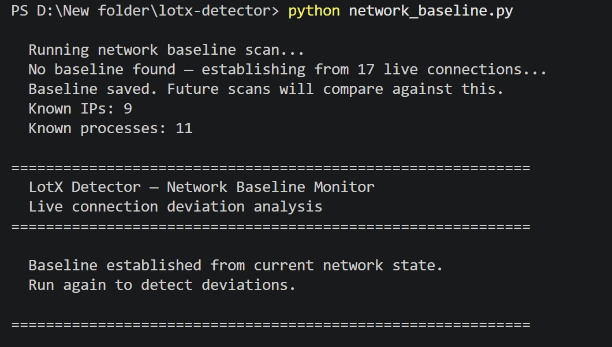
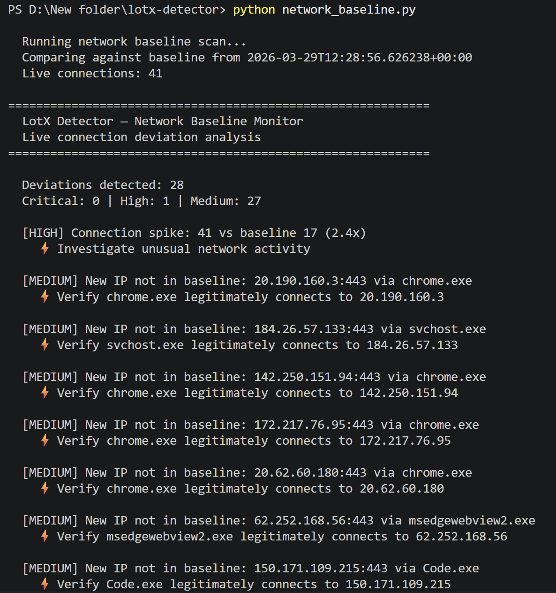

---

## Honest Scope

This tool operates at the individual account level using free APIs. The detection logic is sound. Scaling to organisation-wide coverage requires Google Workspace Admin API and enterprise OAuth discovery — the same data layer Cloudflare CASB uses at scale. That's the next step, not this one.

This is the open-source proof of concept that the detection approach works, built to fill the gap between authentication and content inspection that the 2026 threat report exposed.

---

## Setup

```bash
git clone https://github.com/yashaskl2110/lotx-detector
cd lotx-detector
pip install -r requirements.txt
```

**Google credentials:** Create OAuth client in Google Cloud Console (Calendar API, Desktop app) → download as `credentials.json`

**GitHub token:** Generate personal access token with `read:user`, `read:org`, `public_repo` → save in `.env` as `GITHUB_TOKEN=your_token`

**Android scanning:** Enable USB debugging → connect via USB

```bash
# Full scan - all 7 modules
python main.py

# Individual modules
python tor_monitor.py
python android_scanner.py
python network_baseline.py
python oauth_auditor.py
python detector.py

# Demo mode - replays real scan output, no credentials needed
python main.py --demo

# Continuous monitor - alerts on new findings only
python scheduler.py
```

---

## File Structure

| File | Purpose |
|------|---------|
| `main.py` | Unified entry point — all 7 modules |
| `detector.py` | Core entropy + C2 detection engine |
| `google_calendar.py` | Live Google Calendar API integration |
| `tor_monitor.py` | Live Tor exit node cross-referencing |
| `oauth_scope_checker.py` | Real Google OAuth scope auditor |
| `github_auditor.py` | Real GitHub OAuth auditor |
| `oauth_auditor.py` | Blast radius from real scope data |
| `android_scanner.py` | Android device scanner via ADB |
| `network_baseline.py` | Network baseline profiling |
| `scheduler.py` | 24-hour Calendar C2 continuous monitor — alerts on new findings only |
| `collector.py` | Multi-device aggregated reporting |
| `config.py` | Tunable detection thresholds |

---

## References

- [Cloudflare 2026 Threat Report — Cloudforce One](https://blog.cloudflare.com)
- [Cloudflare BGP Outage Post-mortem, February 2026](https://blog.cloudflare.com)
- [MITRE ATT&CK T1102.002 — Bidirectional Communication via Web Service](https://attack.mitre.org/techniques/T1102/002/)
- [Tor Project Exit Node List](https://check.torproject.org/torbulkexitlist)

---

## Background

Built by a researcher currently investigating iOS 26 ASLR entropy reduction via heap alignment pattern analysis on ARM64 — applying low-level attacker perspective to cloud-layer threat detection.

MSc Cybersecurity, Nottingham Trent University | CompTIA Security+ (SY0-701) | Computer Engineering
